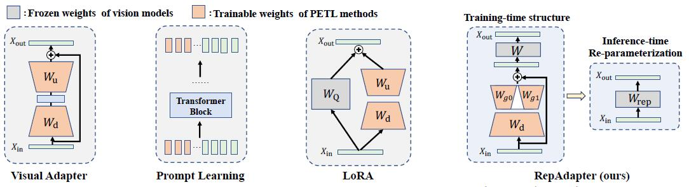

# RepAdapter

Official implementation of "Towards Efficient Visual Adaption via Structural Re-parameterization".
Repadapter is a parameter-efficient and computationally friendly adapter for giant vision models, which can be seamlessly integrated into most
 vision models via structural re-parameterization.


<p align="center">
	
</p>

## Updates 
- (2023/02/16) Release our RepAdapter project.

## Data Preparation
We provide two ways for preparing VTAB-1k:
- Download the source datasets, please refer to [NOAH](https://github.com/ZhangYuanhan-AI/NOAH/#data-preparation).
- We provide the prepared datasets, which can be download from [here](https://1drv.ms/u/s!AmrFUyZ_lDVGinv8y53HX3_rLrpq?e=P5EN5G).

After that, the file structure should look like:
```
$ROOT/data
|-- cifar
|-- caltech101
......
|-- diabetic_retinopathy
```
 
- Download the [pretrained ViT-B/16](https://storage.googleapis.com/vit_models/imagenet21k/ViT-B_16.npz) to `./ViT-B_16.npz`

## Training and Evaluation
1. Search the hyper-parameter s for RepAdapter (optional)
```sh 
bash search_repblock.sh
``` 

2. Train RepAdapter
```sh 
bash train_repblock.sh
``` 

3. Test RepAdapter
```sh 
python test.py --method repblock --dataset <dataset-name> 
```
## Citation

If this repository is helpful for your research, or you want to refer the provided results in your paper, consider cite:
```BibTeX
@article{luo2023towards,
  title={Towards Efficient Visual Adaption via Structural Re-parameterization},
  author={Luo, Gen and Huang, Minglang and Zhou, Yiyi  and Sun, Xiaoshuai and Jiang, Guangnan and Wang, Zhiyu and Ji, Rongrong},
  journal={arXiv preprint arXiv},
  year={2023}
}
```
 
